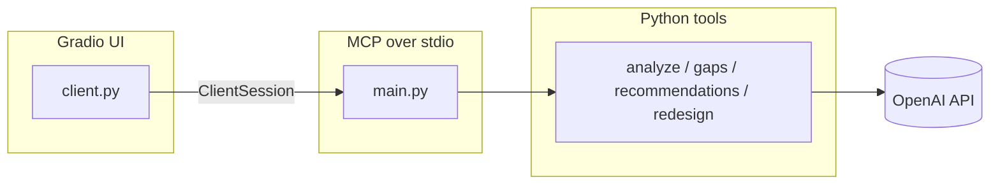

# Consultant AI — MCP process auditor

An **MCP (Model Context Protocol) server** plus a **Gradio web UI** that audits business processes: summarize steps, compare them to AI-generated standards, list gaps, suggest recommendations, and propose a redesigned workflow.

Typical users: consultants, HR, and operations teams who want a quick structured review of a process without building a custom stack.

---

## What it does

| Stage | Description |
|--------|-------------|
| **Analyze** | Normalizes your steps and returns a short summary plus a numbered list. |
| **Detect gaps** | Calls an LLM (via `get_standard`) to infer ideal steps for your domain/process, then flags missing steps. |
| **Recommend** | Turns each gap into a concrete action, reason, and impact. |
| **Redesign** | Produces an improved ordered list of steps informed by those recommendations. |

The server exposes these as MCP **tools** so any MCP-capable client can call them. The included **`client.py`** is a human-friendly Gradio app that runs the same tools over **stdio** (it launches `main.py` as a subprocess).

---

## Architecture



- **`client.py`** — Official `mcp` **client** (`stdio_client` + `ClientSession`). No separate `fastmcp` PyPI package required for the UI.
- **`main.py`** — Uses **`FastMCP` from `mcp.server`** (shipped inside the `mcp` distribution), not `from fastmcp import ...`.
- **`config.py`** — Loads `OPENAI_API_KEY` (used when generating standards in `tools/get_standard.py`).

---

## Requirements

- Python **3.10+**
- An **OpenAI API key** in the environment (`OPENAI_API_KEY`) for gap detection against generated standards. Without it, parts of the pipeline may fail or return empty results depending on your setup.

---

## Installation

From this directory (`6_mcp/community_contributions/eyosiyas`):

```bash
python -m venv .venv
source .venv/bin/activate   # Windows: .venv\Scripts\activate
pip install -r requirements.txt
```

Create a `.env` file (optional; `config.py` uses `python-dotenv`):

```bash
OPENAI_API_KEY=sk-...
```

---

## How to run

**Gradio UI** (recommended for manual testing):

```bash
cd 6_mcp/community_contributions/eyosiyas
python client.py
```

Open the URL printed in the terminal (usually `http://127.0.0.1:7860`). Enter **domain**, **process name**, and **one step per line**, then **Run process audit**. Results appear in tabs; the **Complete report** tab has a large scrollable text area with a **copy** control for the full plain-text output.

**MCP server alone** (for editors or other MCP clients that spawn a stdio server):

```bash
python main.py
```

The server speaks MCP over stdin/stdout.

---

## Project layout

| Path | Role |
|------|------|
| `main.py` | MCP server: registers four tools. |
| `client.py` | Gradio app calling those tools via stdio. |
| `config.py` | API URL / key helpers. |
| `models/schema.py` | Pydantic I/O models for tools. |
| `tools/` | Implementations (`analayze.py`, `detect_gaps.py`, etc.). |

---

## Troubleshooting

- **`ModuleNotFoundError: No module named 'mcp'`** — Install dependencies: `pip install -r requirements.txt`.
- **`Connection closed` / MCP init fails** — Usually the subprocess crashed on startup (e.g. missing `OPENAI_API_KEY` or import error). Run `python main.py` alone to see stderr.
- **`from fastmcp import ...` in your own code** — Prefer `from mcp.server import FastMCP` so you only depend on the **`mcp`** package.

---

## License / attribution

Community contribution under the parent course or repo license. Adjust the clone URL and org name in your fork if you publish this separately.
