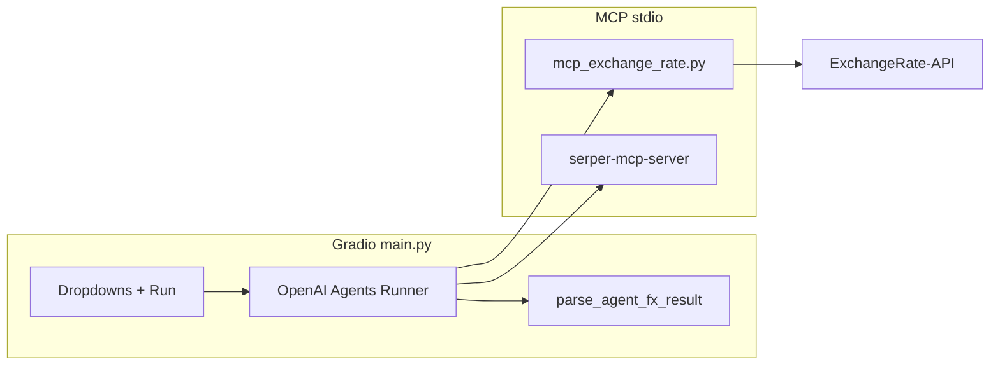

# Forex Agent

AI-assisted FX analysis stack: a **Gradio web dashboard** (`main.py`) runs an **OpenAI Agents** workflow with two **MCP** backends—**live exchange rates** via `exchange_rate.py` and **web search** via Serper (`uvx serper-mcp-server`). Data is backed by [ExchangeRate-API](https://www.exchangerate-api.com/) (v6).

**Requires Python 3.12+** 

---

## What’s in this repo


| Piece                      | Role                                                                                                                                                                                            |
| -------------------------- | ----------------------------------------------------------------------------------------------------------------------------------------------------------------------------------------------- |
| `**main.py`**              | Gradio UI: currency dropdowns, async agent run, markdown dashboard. Spawns MCP children with `MCPServerStdio`; normalizes model output into `pair`, `rate`, `inverse`, `insight`, `trade_idea`. |
| `**mcp_exchange_rate.py`** | FastMCP **stdio** server: cached HTTP requests to ExchangeRate-API; tools `lookup_exchange_rate` and `list_supported_currencies`.                                                               |


---

## Features

### `mcp_exchange_rate.py` (MCP server)

- **Async** fetches with **httpx** against `https://v6.exchangerate-api.com/v6/{API_KEY}/latest/{base_currency}`.
- **In-memory cache** per base currency (default TTL **60 minutes**) to limit API calls.
- **Logging**: file `mcp_exchange_rates_server.txt` + `StreamHandler` (stderr; avoid writing MCP JSON to stdout).
- **Tools**:
  - `**lookup_exchange_rate(target_currency, base_currency="USD")`** — Returns a dict (Pydantic `model_dump`) with `base_currency`, `target_currency`, `exchange_rate`, `timestamp`, `source`, `last_updated_api`, or `{"error": ...}` on failure.
  - `**list_supported_currencies()`** — Ensures USD cache is populated, then returns all codes from `conversion_rates` keys.

Run the server standalone:

```bash
uv run mcp_exchange_rate.py
# or: python mcp_exchange_rate.py
```

### `main.py` (Gradio dashboard)

- **Model**: OpenRouter Chat Completions via `OpenAIChatCompletionsModel` + `AsyncOpenAI` (`OPENROUTER_API_KEY`), default model id `**openai/gpt-4o-mini`**.
- **MCP clients** (long-lived singletons, **async** `__aenter__` on the **same** event loop as Gradio—no `anyio.run()` inside sync click handlers):
  1. **Forex**: `sys.executable` + mcp_`exchange_rate.py`, `cwd` = project root, env = full inherited `os.environ`.
  2. **Search**: `uvx serper-mcp-server` (needs `**uvx`** and `**SERPER_API_KEY`** in the environment).
- **Agent instructions** ask for a **single JSON object** with `pair`, `rate`, `inverse`, `insight`, `trade_idea`.
- `**parse_agent_fx_result()`** if the model returns markdown or fenced JSON:
  - Strips ````json`fences, parses embedded`{ ... }`.
  - **Heuristic table parsing** for forward/inverse rows (e.g. `USD | EUR | 0.8638`).
  - **Trade text** from “Trade recommendation(s)” / short-term sections when `trade_idea` is missing or `UNKNOWN`.
- **UI**: load event fills dropdowns from MCP `list_supported_currencies` when possible, else a static fallback list; **Run Analysis** renders summary tables + full JSON in a collapsible block.

Run the app:

```bash
uv run main.py
```

Then open the local URL Gradio prints (default **[http://127.0.0.1:7860](http://127.0.0.1:7860)**).

---

## Installation

```bash
cd forex-agent
uv sync
# optional dev tools (ipython, ipykernel):
uv sync --group dev
```

---

## Environment variables

Create a `**.env**` in the project root (loaded by `python-dotenv` in both `main.py` and `exchange_rate.py`).


| Variable                    | Used by                | Purpose                                                      |
| --------------------------- | ---------------------- | ------------------------------------------------------------ |
| `**EXCHANGE_RATE_API_KEY**` | `mcp_exchange_rate.py` | [ExchangeRate-API](https://www.exchangerate-api.com/) v6 key |
| `**OPENROUTER_API_KEY**`    | `main.py`              | OpenRouter API for the LLM                                   |
| `**SERPER_API_KEY**`        | Serper MCP child       | Google search via `uvx serper-mcp-server`                    |


Ensure `**uvx**` is on `PATH` when using search MCP. If search fails to start, fix `uv` / Node tooling or temporarily narrow the app to forex-only (code change).

---

## Architecture (high level)




---

## Troubleshooting

1. `**Connection closed` / MCP init errors**
  - Confirm `**EXCHANGE_RATE_API_KEY`** is set and `**exchange_rate.py`** runs: `uv run exchange_rate.py` (should block on stdio; cancel with Ctrl+C).  
  - Ensure `**cwd**` in code points at the repo root so the child script path resolves (already set to `_PROJECT_ROOT` in `main.py`).
2. **Serper / `uvx` failures**
  - Install/update uv; ensure `uvx serper-mcp-server` works in a terminal.  
  - Set `**SERPER_API_KEY`**.
3. **Dropdowns show only fallback list**
  - `list_supported_currencies` failed or tool result could not be parsed; check console logs. Falling back is intentional.
4. **Rates show `N/A` in UI**
  - Model ignored JSON instructions; heuristics should still scrape tables from `insight`. If both fail, verify API key and `lookup_exchange_rate` returns numeric data for the pair.
5. **Gradio 6 theme warning**
  - Theme is passed to `**launch(theme=gr.themes.Soft())`** in `main.py`.

---
